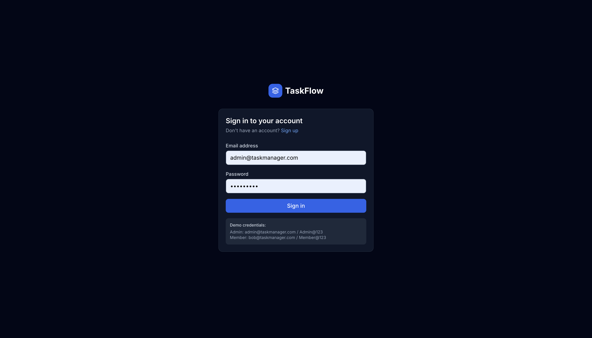
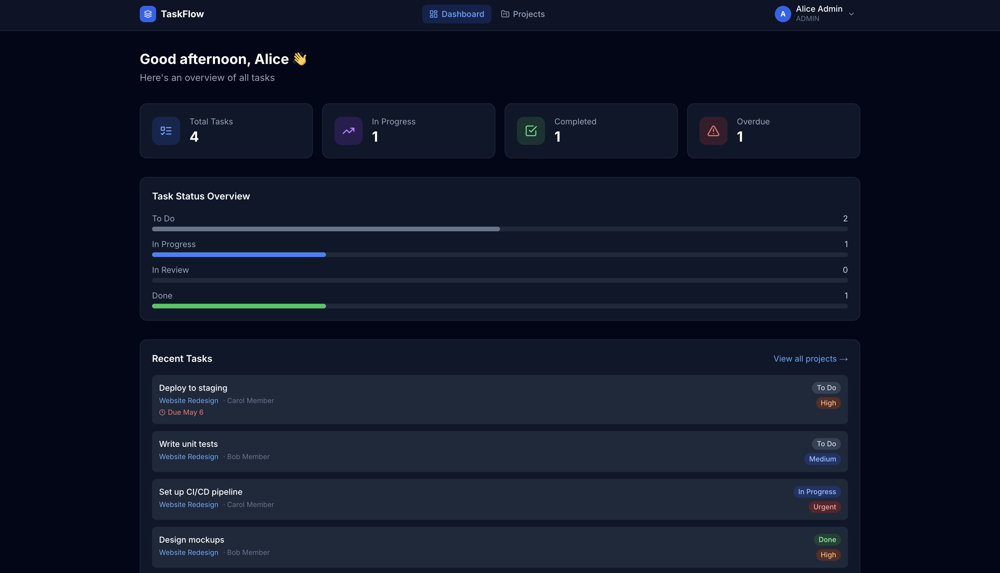
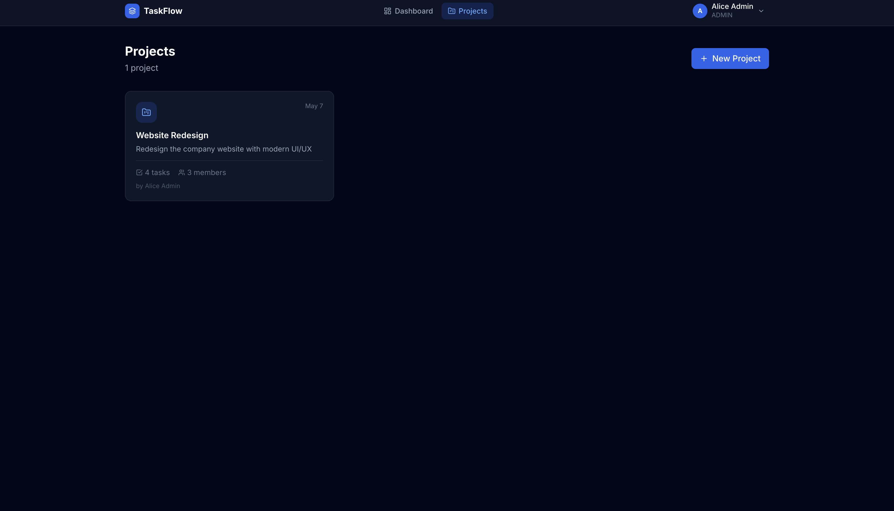
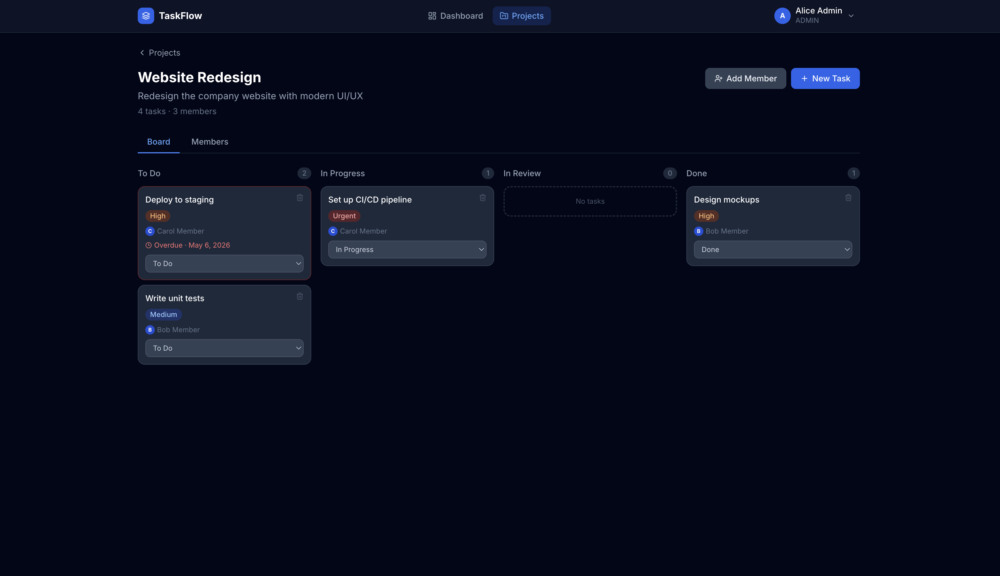

# TaskFlow — Collaborative Project Management Platform

A full-stack web application for managing projects, assigning tasks, and tracking team workflows through role-based access control.

---

## 📌 Overview

- TaskFlow is a collaborative project management platform that enables teams to manage projects, assign tasks, track progress, and enforce role-based access control through a modern full-stack architecture.
- Integrated with GitHub-based CI/CD deployment workflows using Vercel and Railway.

---

## 🚀 Live Demo

- **Frontend:** https://task-manager-ashy-delta.vercel.app
- **Backend API:** https://task-manager-production-020e.up.railway.app
- **GitHub Repository:** https://github.com/pathan-sahil07/task-manager

---

## 📸 Screenshots

### Login Page


### Dashboard


### Projects


### Kanban Board


---

## 🛠 Tech Stack

| Layer | Technology |
|-------|------------|
| Frontend | Next.js 14 (App Router), Tailwind CSS |
| Backend | Node.js, Express.js |
| Database | PostgreSQL (via Prisma ORM) |
| Auth | JWT (Bearer token) |
| Deployment | Vercel (Frontend), Railway (Backend & PostgreSQL) |

---

## ✨ Features

### Authentication
- Signup / Login with email & password
- JWT-based session management
- Protected routes (client & server)

### Projects
- Create, view, update, delete projects
- Add/remove team members with roles (Admin/Member)
- Project overview with task counts

### Tasks
- Create tasks with title, description, priority, due date, assignee
- Kanban board view (To Do / In Progress / In Review / Done)
- Status updates by any assigned member
- Full CRUD for project admins
- Overdue task highlighting

### Dashboard
- Total / In Progress / Done / Overdue task counts
- Visual progress bars per status
- Recent tasks quick view

### Role-Based Access Control (RBAC)

| Action | Global Admin | Project Admin | Project Member |
|--------|---------------|---------------|----------------|
| View projects | ✅ | ✅ | ✅ |
| Create projects | ✅ | ✅ | ✅ |
| Edit/delete project | ✅ | ✅ | ❌ |
| Add/remove members | ✅ | ✅ | ❌ |
| Create tasks | ✅ | ✅ | ❌ |
| Edit/delete tasks | ✅ | ✅ | ❌ |
| Update task status | ✅ | ✅ | ✅ (own tasks) |
| View all tasks | ✅ | ✅ | ✅ |

---

## 📁 Project Structure

```text
task-manager/
├── backend/
│   ├── prisma/
│   │   ├── schema.prisma
│   │   └── seed.js
│   ├── src/
│   │   ├── middleware/
│   │   │   └── auth.js
│   │   ├── routes/
│   │   │   ├── auth.js
│   │   │   ├── projects.js
│   │   │   ├── tasks.js
│   │   │   └── users.js
│   │   └── index.js
│   ├── .env.example
│   └── railway.toml
└── frontend/
    ├── src/
    │   ├── app/
    │   │   ├── (auth)/login/
    │   │   ├── (auth)/signup/
    │   │   ├── dashboard/
    │   │   ├── projects/
    │   │   └── layout.jsx
    │   ├── components/
    │   │   ├── Navbar.jsx
    │   │   └── Badges.jsx
    │   ├── context/
    │   │   └── AuthContext.jsx
    │   └── lib/
    │       └── api.js
    ├── .env.example
    └── railway.toml
```

---

## ⚙️ Local Development

### Prerequisites
- Node.js 18+
- PostgreSQL database
- npm or yarn

### Backend Setup

```bash
cd backend
npm install
cp .env.example .env
npm run db:push
npm run db:generate
npm run db:seed
npm run dev
```

### Frontend Setup

```bash
cd frontend
npm install
cp .env.example .env.local
npm run dev
```

---

## 🌐 Deployment Architecture

### Step 1: Push to GitHub

```bash
git init
git add .
git commit -m "initial commit"
git remote add origin https://github.com/your-username/task-manager.git
git push -u origin main
```

### Step 2: Deploy Database
1. Create a Railway project
2. Add PostgreSQL plugin
3. Copy DATABASE_URL

### Step 3: Deploy Backend
1. Connect backend folder to Railway
2. Configure environment variables
3. Deploy Express backend

### Step 4: Deploy Frontend
1. Connect frontend folder to Vercel
2. Configure NEXT_PUBLIC_API_URL
3. Deploy Next.js frontend

### Step 5: Seed Demo Data

```bash
npm run db:seed
```

---

## 🔌 API Reference

### Auth
| Method | Endpoint | Auth | Description |
|--------|----------|------|-------------|
| POST | /api/auth/signup | ❌ | Register |
| POST | /api/auth/login | ❌ | Login |
| GET | /api/auth/me | ✅ | Current user |

### Projects
| Method | Endpoint | Auth | Admin |
|--------|----------|------|-------|
| GET | /api/projects | ✅ | ❌ |
| POST | /api/projects | ✅ | ❌ |
| GET | /api/projects/:id | ✅ | ❌ |
| PUT | /api/projects/:id | ✅ | ✅ |
| DELETE | /api/projects/:id | ✅ | ✅ |
| POST | /api/projects/:id/members | ✅ | ✅ |
| DELETE | /api/projects/:id/members/:uid | ✅ | ✅ |

### Tasks
| Method | Endpoint | Auth | Description |
|--------|----------|------|-------------|
| GET | /api/tasks/dashboard | ✅ | Stats summary |
| GET | /api/tasks/my | ✅ | My assigned tasks |
| GET | /api/tasks/project/:projectId | ✅ | Tasks in project |
| POST | /api/tasks | ✅ | Create task |
| GET | /api/tasks/:id | ✅ | Get task |
| PUT | /api/tasks/:id | ✅ | Update task |
| DELETE | /api/tasks/:id | ✅ | Delete task |

---

## 🏗 Architecture

```text
Client (Next.js Frontend)
          ↓
REST API (Express.js Backend)
          ↓
Prisma ORM
          ↓
PostgreSQL Database
```

---

## 🧠 Engineering Challenges Solved

- Fixed production CORS issues between Vercel and Railway
- Configured environment variables across cloud platforms
- Connected Prisma ORM with Railway PostgreSQL
- Resolved internal vs public database networking issues
- Implemented JWT authentication and RBAC authorization
- Deployed full-stack app with GitHub CI/CD integration

---

## 📝 Database Schema

```text
User          ── owns ──> Project
User          ── member of ──> ProjectMember <── Project
User          ── assigned to ──> Task
User          ── created ──> Task
Project       ── has ──> Task
```

Models: User, Project, ProjectMember, Task

Enums:
- GlobalRole (ADMIN/MEMBER)
- ProjectRole (ADMIN/MEMBER)
- TaskStatus (TODO/IN_PROGRESS/IN_REVIEW/DONE)
- TaskPriority (LOW/MEDIUM/HIGH/URGENT)

---

## 🚀 Future Improvements

- Real-time collaboration using WebSockets
- Email notifications
- File attachments
- Activity timelines
- Dockerized deployment
- Unit and integration testing

---

## 🧪 Demo Credentials

| Role | Email | Password |
|------|-------|----------|
| Admin | admin@taskmanager.com | Admin@123 |
| Member | bob@taskmanager.com | Member@123 |

---

## 📌 Conclusion

TaskFlow demonstrates full-stack application development, cloud deployment, relational database modeling, authentication workflows, and role-based access control using modern web technologies.

---

## 👤 Author

PATHAN SAHIL - sahil515591@gmail.com
